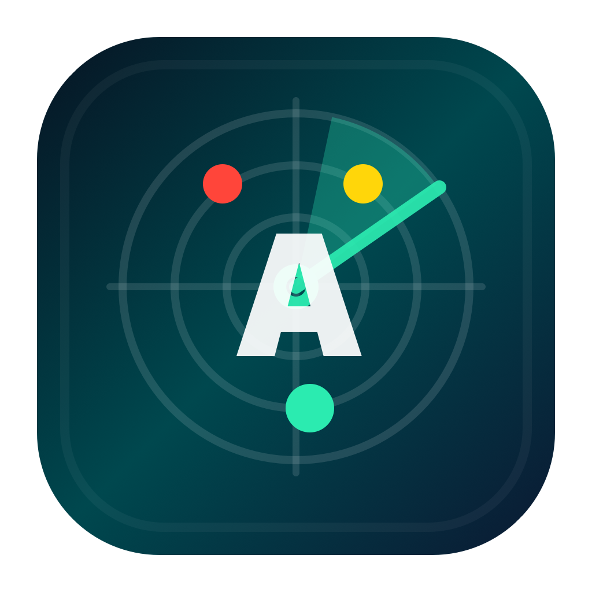

# AgentRadar

English | [简体中文](README.zh-CN.md)

<p align="center">
  
</p>

AgentRadar is a native macOS menu bar app for watching multiple Claude Code and Codex sessions at a glance.

## Features

- Traffic-light status in the menu bar: running, waiting, completed, error, idle.
- Active-session badge count.
- Popover with project name, git branch, current tool, token usage, and recent activity.
- Reads `~/.claude/projects/**/*.jsonl` and `~/.codex/sessions/**/*.jsonl`.
- Hook event source at `~/.agentradar/events.jsonl`.
- Native Swift/AppKit/SwiftUI app with no third-party runtime dependencies.

## Requirements

- macOS 14 or later.
- Swift 5.9 or later.
- Claude Code / Codex.

## Build

```bash
./build.sh
open ./AgentRadar.app
```

`build.sh` runs a SwiftPM release build and assembles `AgentRadar.app`.

## Install Hooks

Codex status depends on hooks. Hooks also make Claude waiting and completed states more reliable:

Open AgentRadar and use the gear button in the popover to install hooks, or keep using the CLI wrapper:

```bash
./install-hooks.sh
```

The install path is handled natively by AgentRadar and does not require `jq`. It backs up and updates `~/.claude/settings.json`, `~/.codex/config.toml`, and `~/.codex/hooks.json`. Codex hooks include `SessionStart`, `PermissionRequest`, `PreToolUse`, `PostToolUse`, and `Stop`. Events are appended to `~/.agentradar/events.jsonl`.

## Package DMG

```bash
./make-dmg.sh
```

`AgentRadar.dmg` is a local build artifact and should not be committed.

## Privacy

AgentRadar only reads local Claude Code / Codex session files and local hook events. It does not upload data and contains no network requests.

## Development

```bash
swift build
swift run AgentRadar
```

This project uses SwiftPM. Source code lives in `Sources/AgentRadar`.

## Uninstall

```bash
rm -rf AgentRadar.app .build AgentRadar.dmg
rm -rf ~/.agentradar
```

To restore hook settings, replace the edited config files with the matching `.bak.<timestamp>` backups created by `install-hooks.sh`.

## License

MIT. See [LICENSE](LICENSE).
